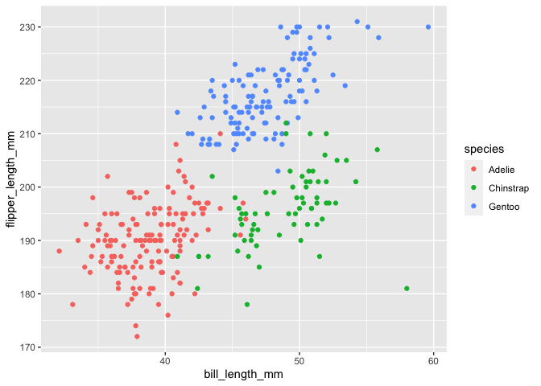

P8105\_hw1\_tbd2117
================
Thiago de Araujo
9/13/2020

### Problem 1

Here’s the first code chunk to create the requested **dataframes** and
its **means**:

``` r
# random sample of size 10 from a standard Normal distribution
samp= rnorm(10)

# logical vector indicating whether elements of the sample are greater than 0
logic= c(samp > 0)

# character vector of length 10
char= c("This", "is", "a", "vector", "that", "contains", "a", "length", "of", "ten")

# factor vector of length 10, with 3 different factor “levels”
factor= factor(c("low", "medium", "high", "medium", "medium", "low", "medium", "low", "high", "low"))

# attempt to take the mean of each data variable
mean(samp)
```

    ## [1] 0.7219721

``` r
mean(logic)
```

    ## [1] 0.9

``` r
mean(char)
```

    ## Warning in mean.default(char): argument is not numeric or logical: returning NA

    ## [1] NA

``` r
mean(factor)
```

    ## Warning in mean.default(factor): argument is not numeric or logical: returning
    ## NA

    ## [1] NA

Taking the mean of each variable works for the *samp* variable (mean =
0.7219721) and for the *logic* variable (mean = 0.9). It does not work
for the char and factor variables.

``` r
# appling the as.numeric function
as.numeric(logic)
as.numeric(char)
as.numeric(factor)
```

Using the *as.numeric* function it is possible to see values being
attributed to TRUE and FALSE in the *logic* variable and for each level
in the *factor* variable. It does help explain what happens when trying
to take means.

Here’s the **second code chunk**:

``` r
as.numeric(logic) * samp
```

    ##  [1] 1.1467205 1.1793016 0.9292141 0.8786018 0.5326530 0.3417674 0.8446841
    ##  [8] 0.0000000 1.3687154 0.6813531

``` r
as.factor(logic) * samp
```

    ## Warning in Ops.factor(as.factor(logic), samp): '*' not meaningful for factors

    ##  [1] NA NA NA NA NA NA NA NA NA NA

``` r
as.numeric(as.factor(logic)) * samp
```

    ##  [1]  2.2934410  2.3586032  1.8584281  1.7572035  1.0653061  0.6835348
    ##  [7]  1.6893683 -0.6832903  2.7374308  1.3627063

### Problem 2

``` r
# loading the penguins dataset
data("penguins", package = "palmerpenguins")
```

The *penguins* dataset contains data on penguin species (Adelie,
Chinstrap, Gentoo), islands (Biscoe, Dream, Torgersen), length of bills
and flippers, body mass, sex, and year.

The dataset has 344 rows and 8 columns.

The mean flipper length is 200.9152047.

``` r
# calling library
library(tidyverse)

# scatterplot of flipper vs. bill length
ggplot(penguins, aes(x=bill_length_mm, y=flipper_length_mm, color=species)) + geom_point()
```

    ## Warning: Removed 2 rows containing missing values (geom_point).

<!-- -->

``` r
# exporting scatterplot 
ggsave("scatter_plot.pdf", height = 4, width = 6)
```

    ## Warning: Removed 2 rows containing missing values (geom_point).
